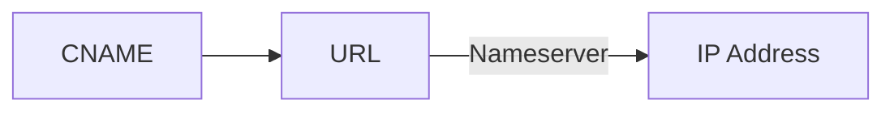
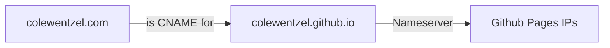
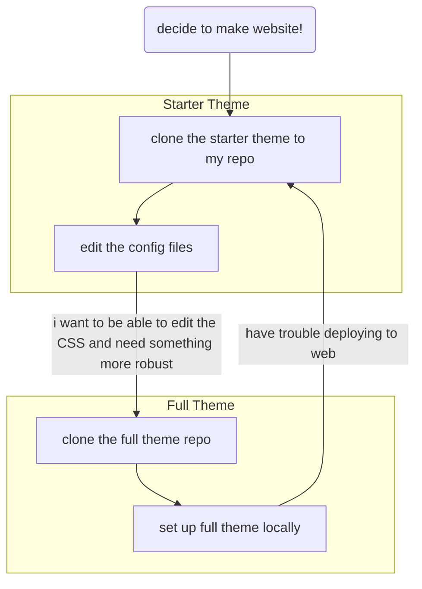

In the pursuit of better organizing my thoughts, I decided to carve out my own corner of the internet with this very website! 

I wanted to have a place where I could write **fun documentation** with a smidge of humor, while also cataloging the steps I'm taking while I figure out each project. Plus, I can use my silly documentation to write actually good documentation later, so this is a double win.

This is a recounting of my journey setting everything up (updated as I attempt to add new fun customizations) along with some potential tips to help anyone else who decides to follow in my footsteps.

## Introduction

I initially thought setting up a web page would be a trivial task, as there are tons of tools already out there for making websites. Heck, several services exist where you can make a one-page portfolio for free, and there are several more full website-builder type services where you pay monthly for them to host your site for you. 

The issues I have these solutions are:

<ol>
  <li><b>Lack of flexibility.</b> A lot of these sites have set templates and all sites have to follow them in some way. I wanted to be able to edit any element to look any way I want. <i>If my UI looks bad, I want it to be fully my fault!!</i>
  
look at this!
</li>
  <li><b>Lack of portibility.</b> These providers own the assets used to make websites on their platforms, and typically make migration difficult. This means I can't take my design with me if I decide I want to export the code and change providers. I'd have to rebuild everything if I were to move.</li>
  <li><b>I want to learn!</b> Using a website builder doesn't actually help me learn front-end development.</li>
</ol> 

<i>That's so expensive. I doubt what I write will ever be popular enough to justify hosting it for more than free ...and I can't take the design with me if I decide to switch hosts >:(</i>

Although I have some experience using Bootstrap to setup a page using HTML, CSS, and a smidge of JavaScript, I am not very experienced. Making a custom layout with Bootstrap is easy for websites that are not updated often, but that's not my use case. I need a space where I can word vomit. I'd need to update multiple pages whenever I make a new post, and while I could potentially make a dynamic site that reads my writings from a database, I didn't want to get into that for this project.

I decided to build my page using Jekyll and host on GitHub Pages. This automates some of the difficulties of setting up a way to neatly display my posts and other musings but also allows me to directly edit the CSS of the page as I get more confident.

Using Jekyll, I'm able to add a new page by typing it out in a markdown editor and run a build command to update the website! But... I can modify the CSS of the site, change how posts are rendered, and have those changes propagate through all of my past posts when I rebuild. I thought this was a perfect balance of custimizability for my use case.

## Setting up GitHub Pages
I've owned `colewentzel.com` for over two years, but I never did anything with it. Honestly, when I bought it I wanted to configure a custom email address but DNS records scared me, and I chose the coward's route of not taking them on.

I bought the domain through Google Domains (now in the [Google Graveyard](https://killedbygoogle.com/)... RIP) and got an email last week about the migration to Squarespace. This reminded me that I had even started this project in the past and gave me the motivation to give it another shot.

Okay, this can't be too hard. I don't have experience with web, but I have been programming for the past four years of my life and I know that every programmer's best friend is ✨documentation✨. My documentation helps me figure out how *my own* code works sometimes, so surely professional documentation will be helpful here.

So we begin: the [GitHub Pages documentation](https://pages.github.com/)! Seems super straightforward, and frankly it was. All I had to do was set up my repository with the right name, and I was off to the races. I got my "Hello world!" page up and running in a matter of minutes as a subdomain of github.io.

<i>Hello colewentzel.github.io.</i>

Unfortunately this was the easy part. I don't want to be `http://colewenzel.github.io/`. I've gotta set up my custom domain, the much more beautiful `http://colewentzel.com`.

## Bespoke Domain
So for some background, browsers actually don't directly access any URL. When someone types a URL into the address bar, the browser sends a request to that domain’s nameservers and asks for the IP address where that website's content is located. That IP is returned as a DNS record called an `A record`.

So I need setup `A records` that point `colewentzel.com` to the IP addresses for GitHub Pages. I navigate to my new domain registrar, Squarespace and set up the DNS records. And...

<i>Well that isn't right...</i>

It turns out I forgot that past me actually switched my domain off the default nameservers and migrated to Cloudflare nameservers. So Squarespace can't edit my DNS records because I'm not even pointing my domain to their address book. Alright, just need to navigate to Cloudflare and set up my DNS records there...

<i>Well... that's a better not right.</i>

Now we are 100% going to GitHub but my site is not here. Why.

...So I got excited and missed a very important step: setting up the `CNAME record` for my domain. A `CNAME record` points one URL to another URL. Say...

So in my case, I need to set it up like this:

I also had to add a file called `CNAME` to my GitHub repository. Once I did this, my page was properly deployed using GitHub Pages. Anyone could type in my custom domain name and see my beautiful `Hello world! :3` text on a white background in all its glory.

## Theme Troubles
So being here, this site is obviously **NOT** just two words on a white background. How did we get here? Jekyll of course!

I followed the [Jekyll Quickstart Guide](https://jekyllrb.com/docs/), installed Ruby for Windows and built my site! Once again, clear documentation is magic! Then I googled "jekyll themes" and began to peruse the possibilities.

I landed on the Chirpy theme, which you see now! But the process of getting here was a bit of a rollercoaster. Like... I'm 46 commits in, just to have a skeleton of a website and I have multiple commits that look like the following: 

<i>Not fixed.</i>

Some of the problems were caused by the theme and the way it's designed, but most were caused by me not entirely understanding what I needed to do. The process should have been like this:

<ol>
  <li>Clone the theme to my repo.</li>
  <li>Edit the config files.</li>
  <li>Write a test post.</li>
  <li>Deploy and see my beautiful website.</li>
</ol> 

**Instead, I was subjected to this:**

Tragic and frustrating!! A huge issue I was having that I didn't realize at the time was that Firefox was caching my website, so even though I saw a perfectly working page after updating, my JavaScript was **broken**. I pushed my page to `main` and deployed it using `deploy from branch: main`. It looked good to me. I started sharing it with my friends, because I was very proud of myself. I will let this image of the aftermath speak for me:

<i>Frantic cries for help. And despair.</i>

 Now I had to get back to investigating. In the docs, I'm told to run `bash tools/init`. I obviously can't run the build file provided in `\tools` on Powershell, because it's a bash script. So, I switched to Windows Subsystem for Linux (WSL) to run it, and I still got an error `-bash: '\r': command not found`.

Not great. Terrible in fact. Luckily, Google comes to the rescue again. I saw that Windows style newline characters can cause issues and using `dos2unix` can make these scripts Unix compatible.

And now it runs, but I get an error. We are failing forward! This time I'm missing `@rollup/plugin-babel`. Okay, install that and now I'm being told `NODE_ENV' is not recognized as an internal or external command, operable program or batch file`. Except I can run the command *by itself*, just not in the bash file. So I go back to the tried and true manual method of reading the code and seeing what it does. And it:

<ol>
  <li>Checks to make sure all current changes are committed.</li>
  <li>Edits the Github Actions of `.github`</li>
  <li>Removes the example posts.</li>
  <li>Builds the JavaScript assets using npm.</li>
  <li>Tracks the JS assets with git.</li>
  <li>Makes a commit with the changes and pushes to the repo.</li>
</ol> 

So I did these things. Additionally, I saw that I should set the repo to use Github Actions to build instead of building from a branch. So I set it up, pushed the changes and... nothing. My GitHub actions workflows weren't starting. But any update to the default branch should trigger the workflows.

## Conclusion
So for all my efforts, I now have an empty site. But it *works.* And it should be easy to maintain and add to from now on. I wish that this wasn't such an ordeal, but we

## Bonus Sidequest: Setting up Email
Something cool about having your own domain name is being able to set up a cool custom email address so people can reach you at something like `me@yourname.com` instead of something *boring* like `yourname@gmail.com`. I obviously wanted to achieve this ultimate bragging right.